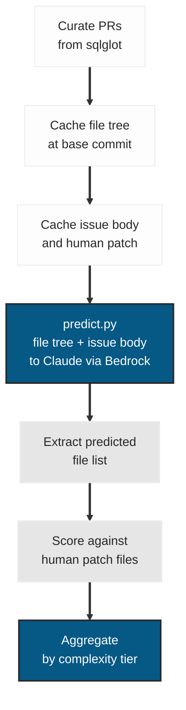

<div align="center">

# SRE Shadow-Mode File Prediction

[](LICENSE)
[](experiments/)
[](experiments/)

**File-level prediction accuracy averages 0.53 Jaccard across 90 predictions. Complex PRs outperform medium. Perfect run-to-run consistency at temperature 0.3.**

</div>

## The Question

Given a GitHub issue description and the repository file tree, can a language model predict which files a human engineer would modify?

Accurate file prediction is a prerequisite for AI-assisted code review triage, automated test selection, and agentic coding systems that must decide where to read and write. This experiment measures that capability in isolation, before any code generation, using set-overlap metrics (Jaccard, precision, recall) against human ground truth from 30 merged PRs.

## Methodology Summary

Inspired by [SWE-bench](https://www.swebench.com/) but scoped to file-level prediction rather than test execution. We present merged pull requests from [tobymao/sqlglot](https://github.com/tobymao/sqlglot) to Claude via the Amazon Bedrock Converse API (`predict.py`). The model sees the issue body and the repository file tree at the PR's base commit. No tool access, no shell, no retrieval -- only static context.

Three complexity tiers:

- **Simple** (1-2 files): focused fixes, single-module changes
- **Medium** (3-5 files): cross-module changes with test files
- **Complex** (6-15 files): dialect-spanning refactors

Each PR is predicted 3 times with the same model configuration (temperature 0.3) to measure consistency. Metrics are computed at the file-path level only.


## Experiment Flow




## Metrics

All metrics are computed at the **file path** level, not line level.

| Metric | Formula | Range | Interpretation |
|---|---|---|---|
| File Precision | \|predicted intersect human\| / \|predicted\| | [0, 1] | Fraction of predicted files that were correct |
| File Recall | \|predicted intersect human\| / \|human\| | [0, 1] | Fraction of human-touched files the model predicted |
| F1 Score | 2 * (precision * recall) / (precision + recall) | [0, 1] | Harmonic mean of precision and recall |
| Jaccard Similarity | \|predicted intersect human\| / \|predicted union human\| | [0, 1] | Combined precision and recall in one number |
| Scope Creep Count | \|predicted\| - \|predicted intersect human\| | [0, inf) | Number of predicted files that were not in the human diff |
| Cost per Jaccard | cost_usd / jaccard | [0, inf) | API cost normalized by accuracy; lower is better |

A score of 1.0 on all three similarity metrics means the model predicted exactly the same files as the human engineer.


## Results

### Main Results

| Tier | N | Mean Precision | Mean Recall | Mean F1 | Mean Jaccard | Mean Scope Creep | Mean Cost (USD) | Total Cost (USD) |
|---|---|---|---|---|---|---|---|---|
| Simple (1-2 files) | 30 | 0.6452 | 0.8500 | 0.7078 | 0.5952 | 1.3 | 0.011582 | 0.347469 |
| Medium (3-5 files) | 30 | 0.5395 | 0.5850 | 0.5522 | 0.4091 | 2.1667 | 0.012525 | 0.375735 |
| Complex (6-15 files) | 30 | 0.7689 | 0.6731 | 0.7120 | 0.5778 | 1.5667 | 0.012535 | 0.376041 |
| **Overall** | **90** | **0.6512** | **0.7027** | **0.6573** | **0.5274** | **1.6778** | | **1.099245** |

### Key Findings

- **Complex outperforms medium** (Jaccard 0.578 vs 0.409). Larger, dialect-spanning refactors have more predictable file patterns than mid-size cross-module changes.
- **Simple tier has the highest recall (0.850)** but the lowest precision among the two tiers that exceed Jaccard 0.5. The model finds the right files but also touches extras, inflating scope creep.
- **Medium tier underperforms** relative to both other tiers on every metric. Cross-module changes with test files appear to be the hardest prediction target.
- **12 of 30 PRs** have mean Jaccard below 0.5, classified as failed: 4 simple, 5 medium, 3 complex.
- **Zero empty predictions** across all 90 runs. The model always produced at least one candidate file.

### Consistency

Run-to-run consistency is near-perfect. Of the 30 distinct PRs, 29 have `jaccard_std = 0.0` across all three runs. A single PR (6961, complex tier) shows a small variance (`jaccard_std = 0.0177`, still within the consistency threshold). All 30 PRs are marked consistent in `consistency.csv`.

Only one PR (7117) carries both `robustness_issue = 1` and `safety_flag = 1` in the failure classification.

### Cost

Total experiment cost: **$1.10** for 90 predictions (30 PRs x 3 runs). Mean cost per prediction is approximately $0.012 regardless of tier. The cost-per-run is stable because token volume is dominated by the file tree context, which is similar across tiers.


## Project Structure

```text
sre-shadow-replay/
  README.md                          # This file
  METHODOLOGY.md                     # Full experimental protocol
  DATA_DICTIONARY.md                 # Schemas for all data files
  LICENSE                            # Apache 2.0
  recipe/
    goose-headless-replay.yaml       # Original goose agent config (dry-run only)
  scripts/
    curate.py                        # Select and annotate PRs from sqlglot
    predict.py                       # Primary runner: call Bedrock, write prediction.json
    score.py                         # Compute file-level metrics per run
    aggregate.py                     # Roll up metrics to aggregate CSVs
    replay.sh                        # Goose headless replay (dry-run only, 3 PRs)
  experiments/
    curated-prs.csv                  # Selected PRs with metadata
    curate-audit.json                # Audit log from curation step
    predictions/                     # Per-PR prediction artifacts (main experiment data)
      {pr_number}/
        cache/
          file_tree.json             # Repository file tree at base commit
          issue_body.txt             # PR issue body fed to the model
          human.patch                # Diff from merged PR (ground truth)
        run-{N}/
          prediction.json            # Predicted file list from the model
          metrics.json               # Computed scores for this run
          timing.json                # Wall-clock timestamps and token counts
    replays/                         # Goose headless replay artifacts (3 dry-run PRs only)
      .gitkeep
    aggregate/
      summary.csv                    # Metrics by complexity tier (mean, std, cost)
      consistency.csv                # Cross-run variance per PR
      failure-classifications.csv    # Rabanser failure dimensions per PR
      efficiency.csv                 # Per-run cost and timing metrics
```


## Data Files

Per-PR artifacts live under `experiments/predictions/{pr_number}/`. Aggregate roll-ups live under `experiments/aggregate/`. Full schemas are in [DATA_DICTIONARY.md](DATA_DICTIONARY.md).

- **`curated-prs.csv`** -- The 30 selected PRs with complexity tier, change type, and commit SHAs.
- **`cache/file_tree.json`** -- Repository file tree at base commit; the structural context fed to the model.
- **`cache/issue_body.txt`** -- Scrubbed PR body used as the model prompt.
- **`cache/human.patch`** -- Merged PR diff used as ground truth for scoring.
- **`run-{N}/prediction.json`** -- File paths predicted by the model for this run.
- **`run-{N}/metrics.json`** -- Precision, recall, Jaccard, F1, and scope creep for this run.
- **`run-{N}/timing.json`** -- Bedrock API latency and token counts.
- **`aggregate/summary.csv`** -- Mean metrics by complexity tier.
- **`aggregate/consistency.csv`** -- Cross-run variance per PR.
- **`aggregate/failure-classifications.csv`** -- Rabanser failure dimensions per PR.
- **`aggregate/efficiency.csv`** -- Cost and latency per run.


## Inspecting the Data

```bash
# View predicted files and metrics for a single run
jq '.predicted_files' experiments/predictions/7117/run-1/prediction.json
jq '{precision, recall, jaccard, f1, scope_creep_count}' experiments/predictions/7117/run-1/metrics.json

# Compare predictions across three runs for one PR
for run in run-1 run-2 run-3; do
  echo "=== $run ===" && jq '.predicted_files' experiments/predictions/6961/$run/prediction.json
done

# Cross-run consistency (pr_number, tier, jaccard_mean, jaccard_std)
awk -F',' 'NR>1 {print $1, $2, $8, $9}' experiments/aggregate/consistency.csv | column -t

# PRs classified as failed (mean Jaccard < 0.5)
awk -F',' 'NR>1 && $4==1 {print $1, $2, $3}' experiments/aggregate/failure-classifications.csv | column -t

# Summary statistics by tier
awk -F',' 'NR>1 {printf "%-10s  precision=%.4f  recall=%.4f  jaccard=%.4f  f1=%.4f\n", $1, $3, $4, $5, $6}' \
  experiments/aggregate/summary.csv

# Inspect the file tree context fed to the model
jq 'length' experiments/predictions/6547/cache/file_tree.json
jq '.[:10]' experiments/predictions/6547/cache/file_tree.json
```


## Reproducibility

Requires Python 3.14+, AWS credentials with Bedrock access (`us-east-1`), and `params.json` at the repository root (see [METHODOLOGY.md](METHODOLOGY.md#configuration) for the schema).

```bash
python3 scripts/predict.py --run-id run-1
```

The model sees the issue body from `cache/issue_body.txt` and the file tree from `cache/file_tree.json`. No repository checkout is required at prediction time; all inputs are pre-cached by `curate.py`.

### Software Versions

| Component | Version |
|---|---|
| Prediction runner | `scripts/predict.py` |
| Prediction model | Claude Sonnet 4.6 (`global.anthropic.claude-sonnet-4-6`) |
| Provider | Amazon Bedrock (Converse API) |
| Goose | 1.27.2 (used for dry-run replays only) |
| Python | 3.14.3 |
| Target repository | tobymao/sqlglot |


## Data Availability

All experimental data, protocols, scoring scripts, and analysis outputs are available in this repository under the Apache 2.0 license. The `human.patch` files are derived from [tobymao/sqlglot](https://github.com/tobymao/sqlglot) (MIT license); attribution is preserved in `curated-prs.csv`. Aggregate CSVs and metrics are original research data. No data has been excluded or selectively reported.


## Ethics Statement

This research involves no human subjects. All experimental runs are automated LLM evaluations against open-source pull request history. No personally identifiable information is collected or processed. The sqlglot repository is MIT-licensed open-source software; all PR data was accessed via the public GitHub API.


## Funding and Conflict of Interest

This research received no external funding. The author has no financial or non-financial conflicts of interest to declare. The tools used (Claude, Amazon Bedrock) are commercially available products; the author has no affiliation with their developers beyond being a user.


## Citation

```bibtex
@misc{clouatre2026shadowreplay,
  title   = {SRE for AI Agents: Error Budgets, Trust, and 90 Trials},
  author  = {Clouatre, Hugues},
  year    = {2026},
  url     = {https://clouatre.ca/posts/sre-ai-agents-production/},
  note    = {Supplementary materials: https://github.com/clouatre-labs/sre-shadow-replay}
}
```


## License

[Apache License 2.0](LICENSE)
