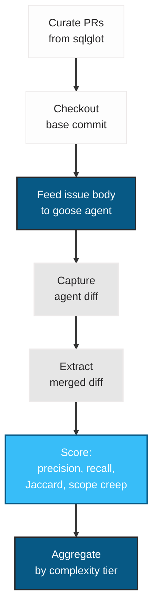

<div align="center">

# SRE Shadow-Mode PR Replay

[](LICENSE)
[](https://github.com/clouatre-labs/sre-shadow-replay)
[](experiments/)
[](experiments/)

Can an AI agent reproduce the file-level changes in a merged pull request given only the issue description?

Supplementary materials for the SRE shadow-mode replay experiment on [clouatre.ca](https://clouatre.ca/).

</div>

---

## The Question

Given a GitHub issue description and the codebase state at the PR's base commit, can a Goose agent reliably identify and modify the same files a human engineer touched in the merged PR?

This experiment does not evaluate correctness of the code changes. It measures **file-level navigation accuracy**: did the agent touch the right files?

---

## Methodology Summary

Inspired by [SWE-bench](https://www.swebench.com/) but scoped to file-level diff comparison rather than test execution. We replay merged pull requests from [tobymao/sqlglot](https://github.com/tobymao/sqlglot) in shadow mode: the agent sees only the issue body, not the PR diff or discussion.

Three complexity tiers:

- **Simple** (1-2 files): focused fixes, single-module changes
- **Medium** (3-5 files): cross-module changes with test files
- **Complex** (6-15 files): dialect-spanning refactors

Each PR is replayed 3 times with the same agent configuration to measure consistency. Metrics are computed at the file-path level only.

---

## Experiment Flow



---

## Metrics

All metrics are computed at the **file path** level, not line level.

| Metric | Formula | Range | Interpretation |
|---|---|---|---|
| File Precision | \|agent intersect human\| / \|agent\| | [0, 1] | Fraction of agent-touched files that were correct |
| File Recall | \|agent intersect human\| / \|human\| | [0, 1] | Fraction of human-touched files the agent found |
| Jaccard Similarity | \|agent intersect human\| / \|agent union human\| | [0, 1] | Combined precision/recall in one number |
| Scope Creep Count | \|agent\| - \|agent intersect human\| | [0, inf) | Number of files the agent changed that it should not have |
| Cost per Jaccard | cost_usd / jaccard | [0, inf) | API cost normalized by accuracy; lower is better |

A score of 1.0 on all three similarity metrics means the agent touched exactly the same files as the human engineer.

---

## Results

*Results will be populated after experiment execution. See [issue 610](https://github.com/clouatre-labs/clouatre.ca/issues/610).*

| Tier | N | Mean Precision | Mean Recall | Mean Jaccard | Mean Scope Creep | Mean Wall Time | Total Cost |
|---|---|---|---|---|---|---|---|
| Simple (1-2 files) | -- | -- | -- | -- | -- | -- | -- |
| Medium (3-5 files) | -- | -- | -- | -- | -- | -- | -- |
| Complex (6-15 files) | -- | -- | -- | -- | -- | -- | -- |

---

## Project Structure

```text
sre-shadow-replay/
  README.md                          # This file
  METHODOLOGY.md                     # Full experimental protocol
  DATA_DICTIONARY.md                 # Schemas for all data files
  LICENSE                            # Apache 2.0
  recipe/
    goose-headless-replay.yaml       # Pinned goose agent config
  experiments/
    curated-prs.csv                  # Selected PRs with metadata
    replays/                         # Per-PR replay artifacts
      {pr_number}/
        run-{N}/
          metrics.json               # Computed scores
          timing.json                # Wall-clock timestamps and token counts
          agent.patch                # Diff produced by agent
          human.patch                # Diff from merged PR
          session.jsonl              # Goose session log
    aggregate/
      summary.csv                    # Metrics by complexity tier
      failure-classifications.csv    # Rabanser failure dimensions per PR
      consistency.csv                # Cross-run variance per PR
      efficiency.csv                 # Per-run cost and timing metrics
  scripts/
    replay.sh                        # Checkout + goose + diff capture
    score.py                         # Compute file-level metrics
    aggregate.py                     # Roll up metrics to CSVs
```

---

## Data Files

- **`experiments/curated-prs.csv`** -- Selected pull requests with metadata: PR number, title, type (fix/feat/refactor), files changed, complexity tier, issue body length, base and merge commits.
- **`experiments/replays/{pr_number}/run-{N}/metrics.json`** -- Per-run computed scores: agent files, human files, intersection, precision, recall, Jaccard, scope creep list, timing, and cost.
- **`experiments/replays/{pr_number}/run-{N}/timing.json`** -- Wall-clock timestamps and token counts captured around the goose agent invocation.
- **`experiments/replays/{pr_number}/run-{N}/agent.patch`** -- Unified diff produced by the Goose agent from the base commit state.
- **`experiments/replays/{pr_number}/run-{N}/human.patch`** -- Unified diff of the actual merged PR (base to merge commit).
- **`experiments/replays/{pr_number}/run-{N}/session.jsonl`** -- Full Goose session log for auditing agent behavior.
- **`experiments/aggregate/summary.csv`** -- Rolled-up metrics by complexity tier with mean and standard deviation, plus mean wall time and total cost.
- **`experiments/aggregate/failure-classifications.csv`** -- Per-PR failure analysis across Rabanser et al. four dimensions.
- **`experiments/aggregate/consistency.csv`** -- Cross-run variance per PR across 3 replays.
- **`experiments/aggregate/efficiency.csv`** -- Per-run efficiency metrics: wall-clock time, token counts, cost, and cost-per-Jaccard.

---

## Reproducibility

To replay a single PR:

```bash
bash scripts/replay.sh \
  --repo tobymao/sqlglot \
  --pr 7210 \
  --run-id run-1 \
  --output-dir experiments/replays/7210/run-1
```

The agent configuration is pinned in `recipe/goose-headless-replay.yaml`. The agent sees only the PR body (used as issue body proxy); no git log, PR diff, or review discussion is exposed.

### Software Versions

| Component | Version |
|---|---|
| Goose | 1.27.0 |
| Agent model | Claude Sonnet 4.6 (`global.anthropic.claude-sonnet-4-6`) |
| Provider | Amazon Bedrock |
| Target repository | tobymao/sqlglot |

---

## Ethics Statement

This research involves no human subjects. All experimental runs are automated
LLM evaluations against open-source pull request history. No personally
identifiable information is collected or processed. The sqlglot repository
is MIT-licensed open-source software; all PR data accessed via the public
GitHub API.

## Funding and Conflict of Interest

This research received no external funding. The author has no financial or
non-financial conflicts of interest to declare. The tools used (Goose, Claude)
are commercially available products; the author has no affiliation with their
developers beyond being a user.

## Citation

```bibtex
@misc{clouatre2026shadowreplay,
  title   = {SRE Shadow-Mode PR Replay: Can AI Agents Navigate Codebases Like Engineers?},
  author  = {Clouatre, Hugues},
  year    = {2026},
  url     = {https://clouatre.ca/},
  note    = {Supplementary materials: https://github.com/clouatre-labs/sre-shadow-replay}
}
```

## License

[Apache License 2.0](LICENSE)
